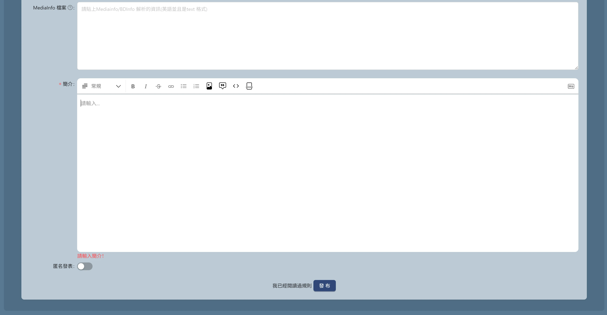
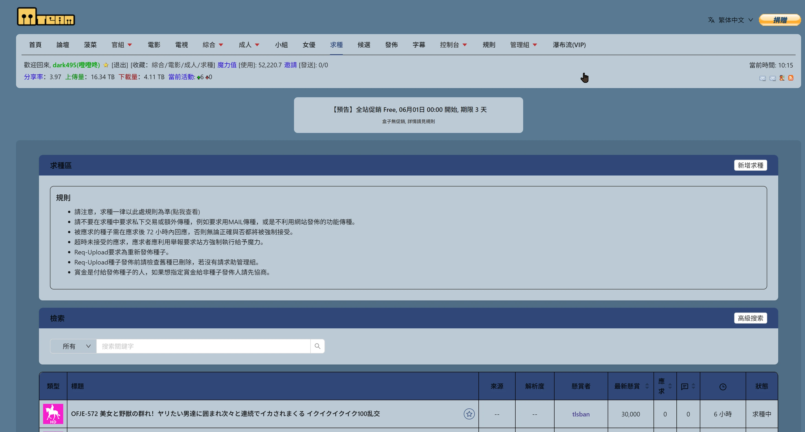
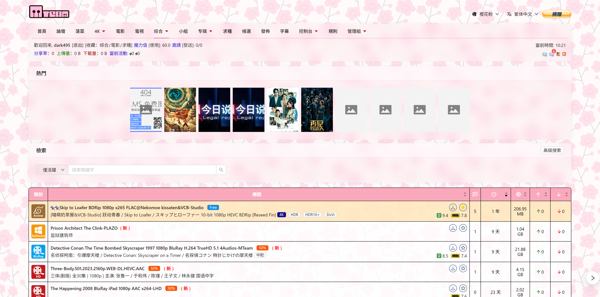
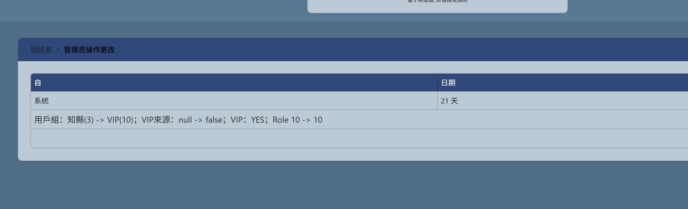
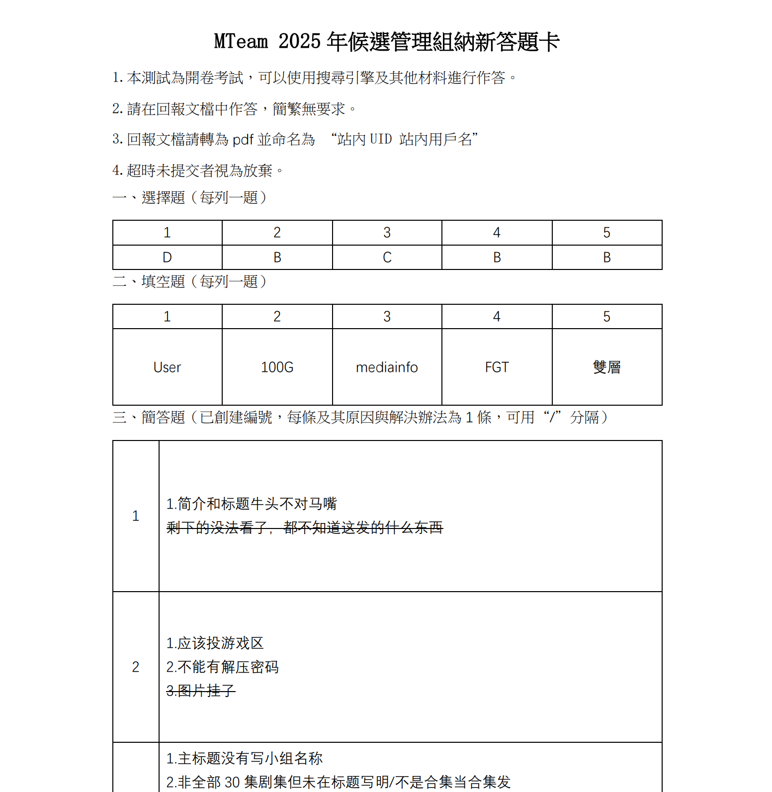
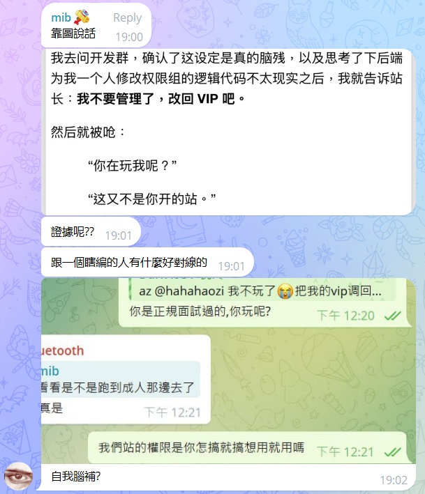
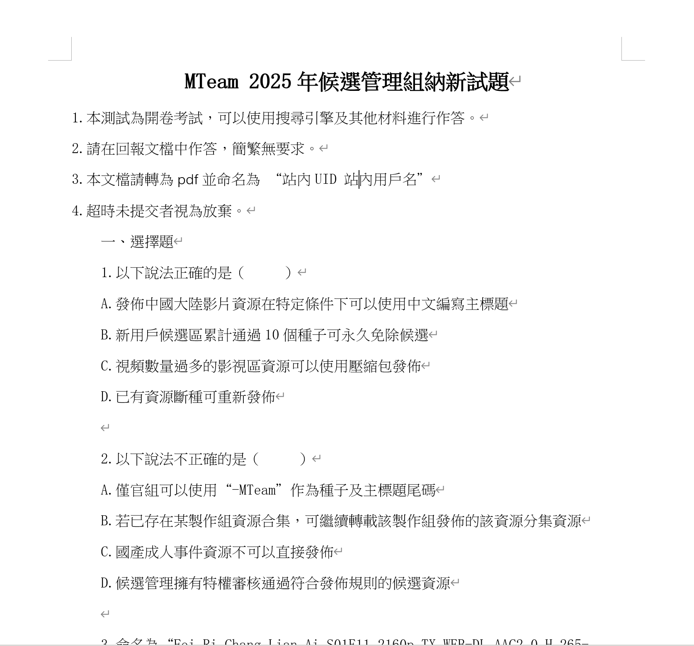
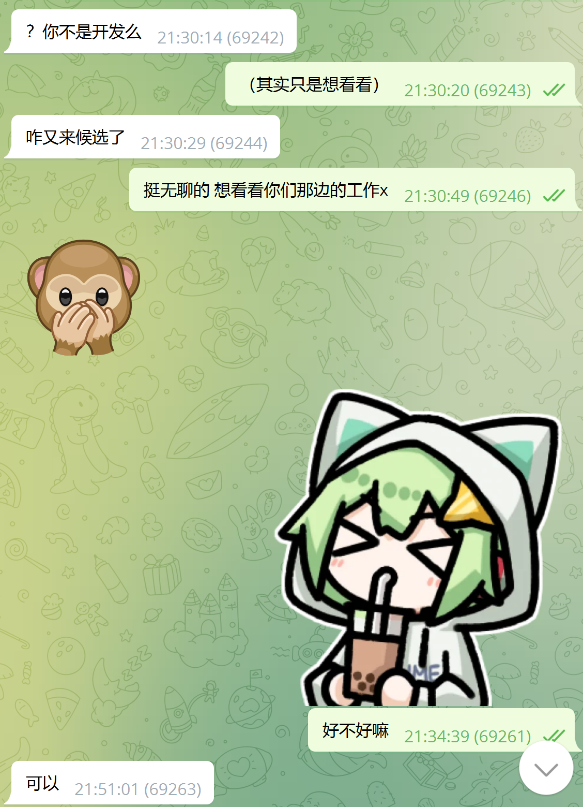

之前为某 PT 站点写了一些前端功能，包括编辑器图片粘贴、两个主题（云朵白/樱花粉）。

因为“太高贵”，站方决定删掉，不配继续提供。

我也理解，毕竟贵站不是我开的。但互联网是开源的，功能大家可以自己装回来。

能用过就好，愿以后还有人愿意免费为他们写插件、修bug、答审核题、陪笑脸。

写代码不难，难的是不被当工具人。

# 在哪可以找回这个主题？

Github：https://github.com/mteam-theme-sakura/theme

油猴：https://greasyfork.org/zh-CN/scripts/537730

项目官网：https://github.com/mteam-theme-sakura

# 用爱发电的代价

在我人生中最扭曲的决定之一，大概就是某天脑抽去给一个 PT 站白打工。

当时只是单纯地喜欢上了这个站，下载了不少曾经想要的稀缺资源，顺带也看到了些功能上不顺眼的地方，于是我主动联系站长，说我可以无偿贡献开发，不用报酬，纯爱发电。

**他说前端用 Vue。结果我拉了代码一看，是 React。**

行，那既然答应都答应了，那我学。

几天速通 React，然后修了几个问题。

首先将我在发布种子时最不顺手的编辑器图片上传功能做了出来，原本是需要点很多下，现在可以直接Ctrl+V粘贴图片，自动上传到站点的图床。



之后又把求种页面的收藏、用户页面的“已提交应求”做了出来。



之后做了两个完整的新主题：云朵白和樱花粉，细节一笔一划地抠，没改旧代码，全部用CSS覆盖，因为原开发者特别喜欢用antd，几乎不自己写样式，并且完全不留下className，只能靠非常暴力的 CSS 选择器拉满，兼容性搞到极致。




之后相安无事了一段时间，直到某天我的联通宽带被限速5M，上传完全跑不上去，而我新开的移动专线还没搞定。

我试探性的问站长能不能开个VIP，结果站长很爽快的答应了，还是永V。



后来他们放公告招审核管理，我也报名了。答题、看规则，**一点不敷衍地认真做完了审核考试，也通过了。**

数天后，我的账号被提升为候选管理。我兴高采烈的开始体验管理功能，并且发现了一些问题。

比如处理举报的时候有很多人填写“修改完毕”，这实际上是种子在发布时有错误，然后发布者修改完成后根据站方要求进行修改，之后使用举报功能举报自己的种子，以通知管理组重新审核。

但是实际操作的时候，很难看出具体修改了什么，有哪些变化，于是我在开发群里提出了一个建议：

> 后端有存储种子修改记录吗？如果有的话，我可以做个种子修改记录对比的功能，类似 Git 的 diff 功能，方便管理组查看种子修改记录。

然后继续处理没处理的举报，顺手下了个种子。

结果我才发现，PT 的权限系统是**互斥的**：VIP 和审核管理不能同时生效。我账号从 VIP 变成了管理，下载文件居然又开始算流量了。

我当时就有点懵了，**我明明是为了给站点做贡献才申请的管理，结果反而被限制了会员功能？**

我去问开发群，确认了这设定是真的脑残，以及思考了下后端为我一个人修改权限组的逻辑代码不太现实之后，我就告诉站长：**我不要管理了，改回 VIP 吧。**

然后就被呛：

> “你在玩我呢？”

> “这又不是你开的站。”

随后我的账号被降为非永久VIP，日期到 2025-06-30。

嗯，“象征性”的永V没了。即使我知道如果我不持续的贡献代码，那我的永V也不可能一直保持。

但是我没想到就这么轻易地被删了，只是因为好像因为所谓的 “面试” “选人” 给他们的管理了很大的负担。

实际上，所谓的面试审核只是发你一份题目，而答题者只需要填空然后转pdf发给管理，他们只需要简单看一眼就能知道你是否合格，并没有多少所谓的负担。



我当场退出开发群，给他发了一段话：

```
我不知道你们是怎么想的，作为pt这种本应该对于贡献者友好的网站方，却对于我这样愿意用爱发电无偿工作的人因为一点小事而嘲讽

我来敲前端，以及我答了一堆题当候选管理，不都是在做贡献？
怎么，我发现VIP没法和候选管理共存所以不做了，就不行了？并且还要当我前面完全没贡献过？
还要被你呛“这站又不是你开的”，您开的站为什么这么低级的问题都能存在呢？

您要真这么想那我以后对贵站心凉了。
```

结果呢？

他直接把我 GitHub 从组织里踢了，Telegram 拉黑，**一句话不回，连个屁都不放。**

而更恶心的是——他还在用户群里开始阴阳怪气：

```
某群友：怎么前两天可以切换主题现在又不行了？
站长mib：(回复)原作者的東西太高貴用不起
某群友：是太高还是太贵？
站长mib：(回复)合起來
某群友：写个js抄一下
站长mib：(回复)高貴之人會有意見
某群友：哈哈哈哈互联网还是有意思
站长mib：可有意思呢
站长mib：我是拉黑了
站长mib：無法溝通
站长mib：人還在群裡
某群友：哎不对啊
某群友：m-team不是自研吗
站长mib：(回复)是呀，但是那功能是一個人做的，跟原團隊無關
```

对此，我对`高貴之人會有意見`回了一句：“我可没意见哈。私人恩怨嘛你干嘛得罪用户呢对吧？还原回去吧。”

然后一个管理回了句：“尊重劳动成果。”

我说：“你们删了我代码反而是不尊重劳动成果了。删了我写的东西我也不可能去别的站放，对吧？”

之后他们选择冷处理，不继续此话题。

于是现在，主题没了，但做的其他功能还在，还是有人在问为什么主题功能没了 :)

## 总结
我一共做了以下功能：
- 给种子页面的副标题加上了悬浮提示
- 发布种子以及`其他任何富文本编辑框`可直接粘贴图片上传到图床
- 用户页展示“已提交应求”
- 求种页加入收藏功能
- 求种页可以过滤`已收藏`
- 顶部用户菜单里的收藏加入了`求种`的链接
- 两个完整主题：云朵白 / 樱花粉

最终获得“报酬”：21天的“永久”VIP + 30天的“限时”VIP + 不被尊重 + 被嘲讽 + 被拉黑 + 被删代码/主题

我会把这段经历原原本本挂出来，不是为了闹事，是为了留个纪念，也是为了让网友们吃个瓜找找乐子 —— **这就是你在互联网上“用爱发电”的下场。**

# 继续吃瓜

继续吃瓜，经过昨天一天的发酵，站长 `mib` 正在和他的心腹管理员 `hahahaozi` 在自己和其他站点的用户群拼命抹黑、妖魔化我。

特别是有这样一张图片被反复拿来鞭尸：


因为当时已经退群，没法看聊天记录，所以我只好回忆：

当我在群里友善地提出一个改进意见后

```
@jiang 后端有存种子修改数据吗？如果有的话感觉可以做一个种子比对的功能，类似git diff（大概要表达的就是这样）
```

测试下载了种子，发现流量被增加，于是我在群里问了，是不是审核管理员权限不能和vip共存，并得到一位开发组成员确认后

```
除了VIP其他权限组的流量都会被记录
```

我用比较**示弱**的语气提出：

```
啊这 @hahahaozi 我不玩了😭把我vip调回去吧 @mib
```

对方却用非常粗暴的，好似是在对**陌生人发号施令**：

```
你是正规面试过的，你玩呢？
我们站的权限是你怎搞就怎搞想用就用的吗？
```

这就像是我让他们花了几个月的时间对我进行了背调，**在准备和进行面试时对我花费了巨量的时间和精力，历尽千辛万苦终于找到合适的人了**  
**然后我刚拿到他们的权限就立刻反手把网站 `rm -rf /*` 了**，仿佛我犯了滔天大罪，是这样吗？

以及那一句
```
这又不是你开的站
```
这句话是经过上面的内容后，`mib` 私聊我的时候回复的，当时有更多呛人的话，但我已经忘了。  
*对啊，这是你用来赚米的站，我怎么能撼动得了你这位土皇帝？*

## 那么所谓的面试有多麻烦呢？  
实际流程就是，**对方发你个模板题目，你按答题卡来填，几乎一眼就可以看出来你能不能过了。**

答题卡的内容我已经在上面放过了，**就截图内容那么多**，这里放一下题目的图片。



好的，如果你通过了面试，需要怎么上班呢？

```
您好，恭喜您通過管理考核。以下是一些補充事項：
1.個人原因離職前請提前30天告知管理組。
2.每日計劃排版時間為9-16、16-23（UTC+8），值班時間段内需及時查看候選區與舉報區並及時處理。
3.實習期為1-2月，具體根據掌握進度決定。
4.若有重大錯誤及其他事項，如多次未調班曠工、使用管理權限解決私人恩怨等，管理組具有撤銷權限的權力。
以上，若同意入職請在29日0時前回復本消息確認入職。
若有個人變更或其他情況也請説明。
```

特别是：
```
排班时间随机，上午和下午的都会轮到
```

看着够苛刻了对吧？这种排班扔到线下岗位，起码也得照着市面兼职时薪结算吧？不然谁愿意打卡上岗？

那么来看看有什么报酬？

```
1.正式工資每月魔力值5w，離職時統一結算;
2.每月可申一枚官方邀，不累加，本邀無特殊待遇，仅作爲員工;
3.任期满1年離職時給予1年貴賓權限;
4.實習期工資每月魔力值2w，無其他。結束實習期時結算。實習期不满一個月按一個月計算。
退休:
1.實習期轉正後，任一年，一年後可申請退休為一年期VIP(任職年數越多，退休福利越好，有重大貢獻者可永久VIP);
2.旷工三次者自動清退，發放至上月工資，不满1月無工資。
休假：
采用輪休方式，按照排班表進行工作。若有個人原因不能核需提前管理員進行調整。
```

翻译：
你要给我按照**打工人**的标准，按**排班**时间给我工作，但我不发*money*，我发2w*斗地主欢乐豆*，转正了发5w*欢乐豆*，并且还要在你*离职的时候才发*（哦我去，我回头细看才发现，比不少现实公司都狠）。  
你**干完一年以后要求更严格**了呢，旷工*三次*以后欢乐豆就不发了噢，不仅不发还会把你**开除并且没有n+1**噢w。

# 一些需要重新说明的地方
> 你都说了是无偿开发，为什么还要vip？给你了你还不满意吗？

当我提出可以无偿开发的时候，站长 mib 一开始就和我说“多少是要给一点的 不然传出去名声不好”，所以我才会在宽带被限速后从他那里寻求帮助。   
事实上我一开始也不打算去要vip，直到我想买个服务器做来辅种刷上传，发现太麻烦。

> 你不是要给站点做贡献吗？怎么一看到流量会增加就甩手不干了？
> 你太幽默了/你就站在道德的制高点写小作文噢

我一开始确实是想要做贡献的，但当我发现站点的管理组对于贡献者的态度是这样的，我就不想继续了。
 
实际上在所谓面试开始之前我就提出 **“（其实只是想看看）” “挺无聊的 想看看你们那边的工作x”** ，审核管理员当即就回复了 **“好”**


这也是我为什么会随意提出“不要管理了调回vip”的原因，因为我一开始的目的就只是想看看审核功能有没有让人不爽的问题，顺便满足一下求知欲，让我知道审核具体是怎么工作的。

> 这都是你的一面之词，你为什么不放聊天记录？

因为我已经退群/删好友了，当时躺床上，*iOS 上的 Telegram 对着会话列表从右往←左划，点红色按钮就能退群*，并且聊天记录会被删。

当我意识到刚刚干了多么脑抽的事情，应该先去电脑上导出一下聊天记录再这么干的时候，已经晚了 Orz

# 所以我知道了什么？
根据 v2ex [#70](https://www.v2ex.com/t/1135499?p=1#r_16321955) 的回复：
```
贴吧有人无脑鼓吹，mt 接受捐赠的支付宝账号有段时间经常达到限额，一直在圈米。这给了站长很大的底气武断行事。
这么多年 mt 对于 pt 圈子的贡献跟它的规模是不成正比的。
而且站点资源突出一个乱，资源管理无从谈起。
```
这里不是我应该当贡献者的地方，这个网站只是他们的**圈钱工具**，他们所做的一切都只是为了利益，像是提升用户体验这种事情根本不会去做。

他们只会将所有的**贡献者(包括发种/审核/开发userscript)** 当成用来帮助盈利的*工具人*，直到你不再为他们提供价值。

我已收到来自 `@mcone` 的邀请(在此十分感谢)，加入了某学校类的PT站点，在稍微体验了一下功能后，不禁感叹其功能的完善，我不得不说这里才是贡献者应该待的地方，氛围比起某些站好的不能再好了。
