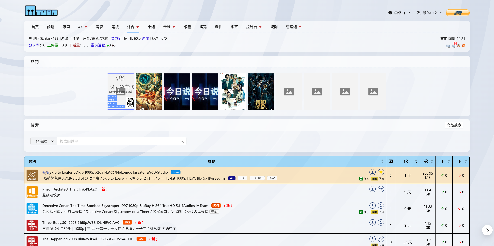

之前为某 PT 站点写了一些前端功能，包括编辑器图片粘贴、两个主题（云朵白/樱花粉）。

因为“太高贵”，站方决定删掉，不配继续提供。

我也理解，毕竟贵站不是我开的。但互联网是开源的，功能大家可以自己装回来。

能用过就好，愿以后还有人愿意免费为他们写插件、修bug、答审核题、陪笑脸。

写代码不难，难的是不被当工具人。

# 用爱发电的代价

在我人生中最扭曲的决定之一，大概就是某天脑抽去给一个 PT 站白打工。

当时只是单纯地喜欢上了这个站，下载了不少曾经想要的稀缺资源，顺带也看到了些功能上不顺眼的地方，于是我主动联系站长，说我可以无偿贡献开发，不用报酬，纯爱发电。

**他说前端用 Vue。结果我拉了代码一看，结果是 React。**

行，那既然答应都答应了，那我学。

几天速通 React，然后修了几个问题。

首先将我在发布种子时最不顺手的编辑器图片上传功能做了出来，原本是需要点很多下，现在可以直接Ctrl+V粘贴图片，自动上传到站点的图床。


之后又把求种页面的收藏、用户页面的“已提交应求”做了出来。


之后做了两个完整的新主题：云朵白和樱花粉，细节一笔一划地抠，没改旧代码，全部用CSS覆盖，因为原开发者特别喜欢用antd，几乎不自己写样式，并且完全不留下className，只能靠非常暴力的 CSS 选择器拉满，兼容性搞到极致。



之后相安无事了一段时间，直到某天我的联通宽带被限速5M，上传完全跑不上去，而我新开的移动专线还没搞定。

我试探性的问站长能不能开个VIP，结果站长很爽快的答应了，还是永V。


后来他们放公告招审核管理，我也报名了。答题、看规则，**一点不敷衍地认真做完了审核考试，也通过了。**

数天后，我的账号被提升为候选管理。我兴高采烈的开始体验管理功能，并且发现了一些问题。

比如处理举报的时候有很多人填写“修改完毕”，这实际上是种子在发布时有错误，然后发布者修改完成后根据站方要求进行修改，之后使用举报功能举报自己的种子，以通知管理组重新审核。

但是实际操作的时候，很难看出具体修改了什么，有哪些变化，于是我在开发群里提出了一个建议：

> 后端有存储种子修改记录吗？如果有的话，我可以做个种子修改记录对比的功能，类似 Git 的 diff 功能，方便管理组查看种子修改记录。

然后继续处理没处理的举报，顺手下了个种子。

结果我才发现，PT 的权限系统是**互斥的**：VIP 和审核管理不能同时生效。我账号从 VIP 变成了管理，下载文件居然又开始算流量了。

我当时就有点懵了，**我明明是为了给站点做贡献才申请的管理，结果反而被限制了会员功能？**

我去问开发群，确认了这设定是真的脑残，以及思考了下后端为我一个人修改权限组的逻辑代码不太现实之后，我就告诉站长：**我不要管理了，改回 VIP 吧。**

然后就被呛：

> “你在玩我呢？”

> “这又不是你开的站。”

随后我的账号被降为非永久VIP，日期到 2025-06-30。

嗯，“象征性”的永V没了。即使我知道如果我不持续的贡献代码，那我的永V也不可能一直保持。

但是我没想到就这么轻易地被删了，只是因为好像因为所谓的 “面试” “选人” 给他们的管理了很大的负担。

实际上，所谓的面试审核只是发你一份题目，而答题者只需要填空然后转pdf发给管理，他们只需要简单看一眼就能知道你是否合格，并没有多少所谓的负担。


我当场退出开发群，给他发了一段话：

```
我不知道你们是怎么想的，作为pt这种本应该对于贡献者友好的网站方，却对于我这样愿意用爱发电无偿工作的人因为一点小事而嘲讽

我来敲前端，以及我答了一堆题当候选管理，不都是在做贡献？
怎么，我发现VIP没法和候选管理共存所以不做了，就不行了？并且还要当我前面完全没贡献过？
还要被你呛“这站又不是你开的”，您开的站为什么这么低级的问题都能存在呢？

您要真这么想那我以后对贵站心凉了。
```

结果呢？

他直接把我 GitHub 从组织里踢了，Telegram 拉黑，**一句话不回，连个屁都不放。**

而更恶心的是——他还在用户群里开始阴阳怪气：

```
某群友：怎么前两天可以切换主题现在又不行了？
站长mib：(回复)原作者的東西太高貴用不起
某群友：是太高还是太贵？
站长mib：(回复)合起來
某群友：写个js抄一下
站长mib：(回复)高貴之人會有意見
某群友：哈哈哈哈互联网还是有意思
站长mib：可有意思呢
站长mib：我是拉黑了
站长mib：無法溝通
站长mib：人還在群裡
某群友：哎不对啊
某群友：m-team不是自研吗
站长mib：(回复)是呀，但是那功能是一個人做的，跟原團隊無關
```

对此，我对`高貴之人會有意見`回了一句：“我可没意见哈。私人恩怨嘛你干嘛得罪用户呢对吧？还原回去吧。”

然后一个管理回了句：“尊重劳动成果。”

我说：“你们删了我代码反而是不尊重劳动成果了。删了我写的东西我也不可能去别的站放，对吧？”

之后他们选择冷处理，不继续此话题。

于是现在，主题没了，但做的其他功能还在，还是有人在问为什么主题功能没了 :)

## 总结
我一共做了以下功能：
- 给种子页面的副标题加上了悬浮提示
- 发布种子以及`其他任何富文本编辑框`可直接粘贴图片上传到图床
- 用户页展示“已提交应求”
- 求种页加入收藏功能
- 求种页可以过滤`已收藏`
- 顶部用户菜单里的收藏加入了`求种`的链接
- 两个完整主题：云朵白 / 樱花粉

最终获得“报酬”：21天的“永久”VIP + 30天的“限时”VIP + 不被尊重 + 被嘲讽 + 被拉黑 + 被删代码/主题

我会把这段经历原原本本挂出来，不是为了闹事，是为了留个纪念，也是为了让网友们吃个瓜找找乐子 —— **这就是你在互联网上“用爱发电”的下场。**

